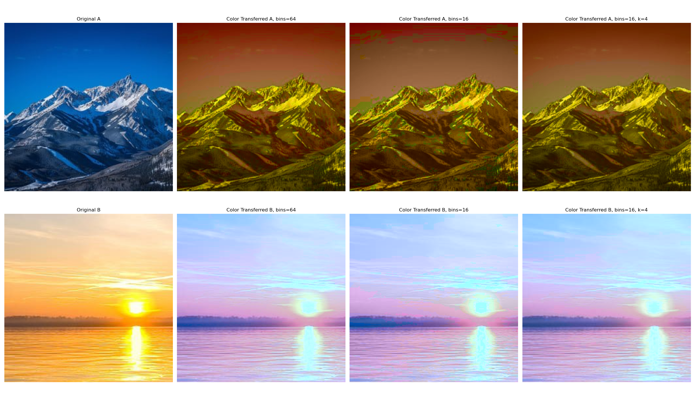

# **Convolutional Wasserstein Distance for Image and Shape Transfer**

## **Introduction**
This project explores the use of **Convolutional Wasserstein Distances (CWD)** for efficient image and shape transfer. The algorithms in use here were introduced in the paper "Convolutional Wasserstein Distances:Efficient Optimal Transportation on Geometric Domains" by Solomon et al.
The Wasserstein distance, a fundamental metric in optimal transport, enables seamless transformations between distributions, making it highly effective in applications such as **color transfer, shape interpolation, and entropy sharpening**.

While traditional optimal transport computations are computationally expensive, the CWD framework leverages:
- **Entropic regularization** for computational efficiency.
- **Heat-kernel approximations** to approximate geodesic distances.
- **K-Nearest Neighbors (KNN) for color detail preservation**.
- **Entropy sharpening for sharper barycenters**.

---

## **Results**

### **1. Color Transfer**
Using Wasserstein barycenters, we efficiently interpolate color distributions between images.

#### **1.1 Effect of Weight on Color Transfer**
The weight parameter controls the influence of the source and target histograms. Below is a comparison showing the gradual transition of color between two images under different weights.

| |

#### **1.2 Effect of KNN on Color Transfer**
To optimize efficiency, we reduce histogram binning complexity from **O(n log² n)** to **O(n' log² n')** (where n' ≪ n), significantly improving speed. However, reducing bins too much can lead to **loss of detail**. We mitigate this by applying **K-Nearest Neighbors (KNN)**, which restores finer details while maintaining computational efficiency.

| |

---

### **2. Shape Transfer and Entropy Sharpening**
Beyond color transfer, we explore **shape interpolation** using Wasserstein barycenters. By leveraging **entropy regularization**, we generate smooth transformations between geometric shapes.

We demonstrate the transformation between two shapes using Wasserstein barycenters. Unlike naive averaging methods, which create superposition-like transitions, the approach presented in the article ensures a geometrically meaningful transformation.

#### **2.1 Effect of Entropy Sharpening**
One drawback of entropy regularization is that it tends to produce **overly diffuse results**. To counteract this, **entropy sharpening** constrains the entropy of the barycenter, leading to more defined features.

| Without Sharpening | With Sharpening |
|--------------------|----------------|
|  |  |

---

## **Conclusion**
This project demonstrates the power of **Convolutional Wasserstein Distances** for efficient **color and shape transfer**. Our enhancement, that includes a **KNN step** for color transfer can significantly improve detail preservation and computational performance of this task.

### **Future Work**
- **Spatially adaptive entropy regularization** for content-aware transfer and improved high-frequency details preservation.
- **Application of Wasserstein distances in 3D object transformations**.

For further details, please refer to the source code and documentation.

---
